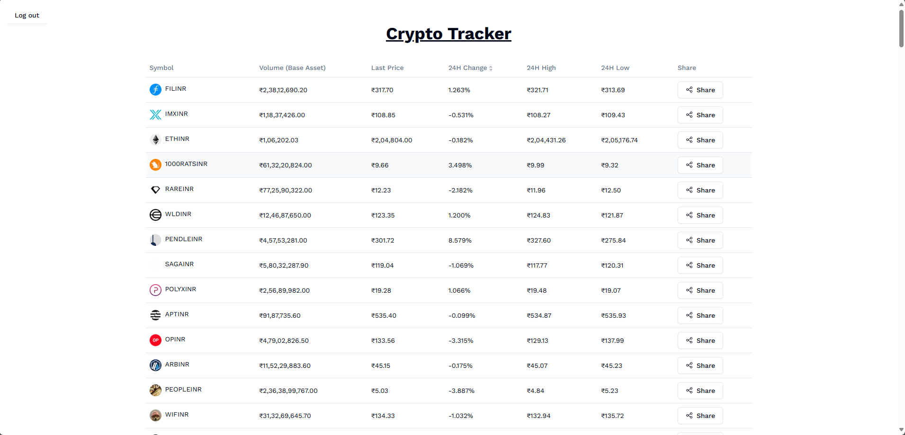

# Crypto tracker

## Format

symbol name | last price | 24 hour change percentage | 24 hour volume | 24 hour high | 24 hour low | share

Every row contains details on a particular crypto contract. Share button in the last column where the particular crypto contract details can be shared over whatsapp with details from all the columns of the contract, like the below example. If the share is not supported by the browser, we can download the content.

## Content format

Welcome to crypto tracker! Today's update on Bitcoin. <br/>
symbol name: BTC/INR <br/>
last price: ₹60,58,593 <br/>
24 hour change percentage: 0.01% <br/>
24 hour volume: 1,75,000 <br/>
24 hour high: ₹61,60,580 <br/>
24 hour low: ₹60,00,001 <br/>

This is a [Next.js](https://nextjs.org/) project.

## Getting Started

Install dependencies

```bash
npm install
```

Run the development server:

```bash
npm run dev
# or
yarn dev
# or
pnpm dev
# or
bun dev
```

Open [http://localhost:3000](http://localhost:3000) with your browser to see the result.

Deployed on vercel [https://pi42-three.vercel.app](https://pi42-three.vercel.app)


